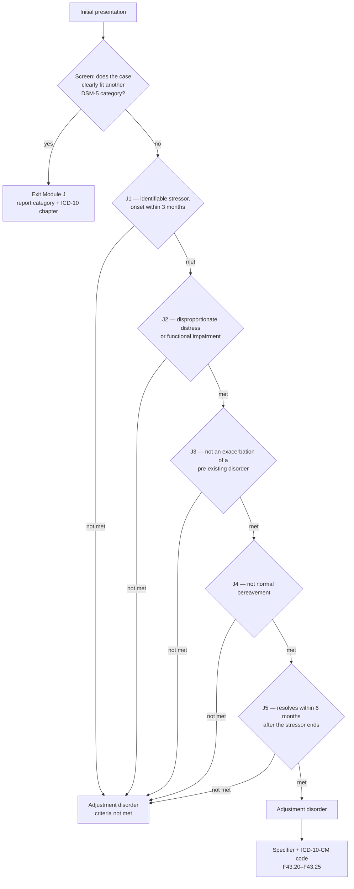
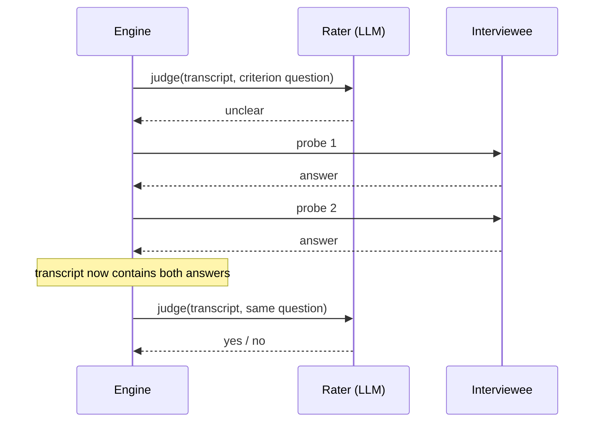

# Module J decision tree

Adjustment disorder is a residual diagnosis: DSM-5 reaches it only after the
presentation has failed to fit a better-defined category. The engine mirrors
that ordering — screening first, then the J1–J5 chain, then the specifier.

## What happens at each node

The rater model is asked one criterion question against the full transcript and
must answer `yes`, `no`, or `unclear`.

Three properties fall out of this shape:

- **Probes are bounded.** Each criterion's probes are asked at most once, so a
  rater that never commits cannot loop.
- **Context accumulates.** A probe answered at J1 is still in the transcript
  when J5 is rated, which is how a single timeline statement can settle two
  different criteria.
- **Undetermined is not met.** A criterion still `unclear` after probing is
  recorded as not met, with that fact stated in the rationale. For a screening
  aid, missing a case is the safer error.
